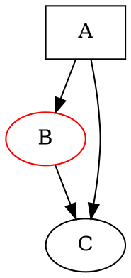

# TLDR

**Render DOT file to PNG**

```dot -Tpng [graph.dot] -o [graph.png]```

**Render to SVG**

```dot -Tsvg [graph.dot] -o [graph.svg]```

**Use different layout engine**

```neato -Tpng [graph.dot] -o [graph.png]```

**Render to PDF**

```dot -Tpdf [graph.dot] -o [graph.pdf]```

**Circular layout**

```circo -Tpng [graph.dot] -o [graph.png]```

# SYNOPSIS

**dot** [_options_] [_files_]

# PARAMETERS

**-T** _format_
> Output format: png, svg, pdf, ps, jpg.

**-o** _file_
> Output file.

**-K** _engine_
> Layout engine: dot, neato, fdp, sfdp, circo, twopi.

**-G** _name=value_
> Set graph attribute.

**-N** _name=value_
> Set node attribute.

**-E** _name=value_
> Set edge attribute.

# LAYOUT ENGINES

```
dot    - Hierarchical (directed graphs)
neato  - Spring model (undirected)
fdp    - Force-directed
sfdp   - Scalable force-directed
circo  - Circular layout
twopi  - Radial layout
```

# DOT LANGUAGE



# DESCRIPTION

**Graphviz** is a graph visualization toolkit. It reads graph descriptions in DOT language and renders them as images. Multiple layout algorithms handle different graph types.

# CAVEATS

Large graphs may be slow to render. Layout quality varies by algorithm choice. Complex styling requires learning DOT attributes. Text rendering may vary by output format.

# HISTORY

Graphviz was developed at **AT&T Labs Research**, with initial work by **Stephen North**, **Emden Gansner**, and others in the **1990s**. It was open-sourced and became the standard for programmatic graph visualization.

# SEE ALSO

[dot](/man/dot)(1), [neato](/man/neato)(1), [mermaid](/man/mermaid)(1)
