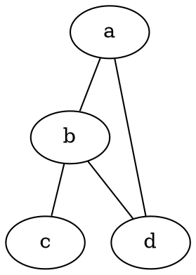

# TLDR

**Generate PNG from DOT file**

```neato -Tpng [graph.dot] -o [output.png]```

**Generate SVG**

```neato -Tsvg [graph.dot] -o [output.svg]```

**Generate PDF**

```neato -Tpdf [graph.dot] -o [output.pdf]```

**Read from stdin**

```echo "graph { a -- b }" | neato -Tpng -o [output.png]```

**Set graph attributes**

```neato -Gsize="10,10" -Nshape=box [graph.dot] -o [output.png]```

# SYNOPSIS

**neato** [_options_] [_files_...]

# PARAMETERS

**-T** _format_
> Output format (png, svg, pdf, etc.).

**-o** _file_
> Output file.

**-G** _attr=val_
> Graph attribute.

**-N** _attr=val_
> Node attribute.

**-E** _attr=val_
> Edge attribute.

**-K** _layout_
> Layout engine.

# DESCRIPTION

**neato** is a Graphviz layout program for undirected graphs. It uses a spring model algorithm to produce aesthetically pleasing layouts, making it ideal for network diagrams and relationship graphs.

Unlike dot (hierarchical), neato creates symmetric, radial layouts.

# EXAMPLE GRAPH



# LAYOUT ENGINES

```
neato  - Spring model (undirected)
dot    - Hierarchical (directed)
circo  - Circular
fdp    - Force-directed
sfdp   - Large graphs
```

# CAVEATS

Better for undirected graphs. Large graphs may be slow. Overlap removal may need tuning.

# HISTORY

neato was developed by **Stephen North** at AT&T Labs as part of the Graphviz suite, implementing the Kamada-Kawai spring algorithm.

# SEE ALSO

[dot](/man/dot)(1), [circo](/man/circo)(1), [fdp](/man/fdp)(1), [graphviz](/man/graphviz)(1)
